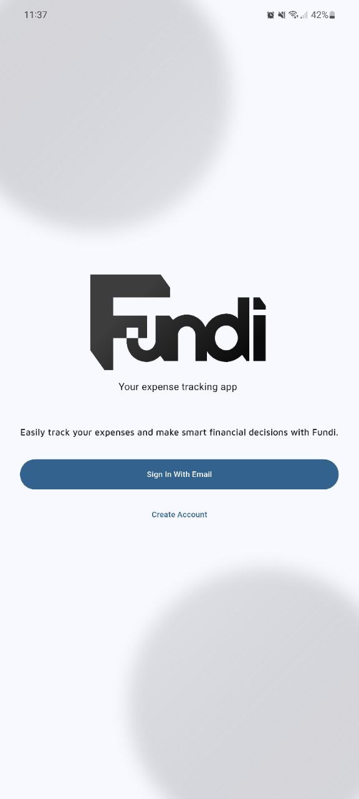
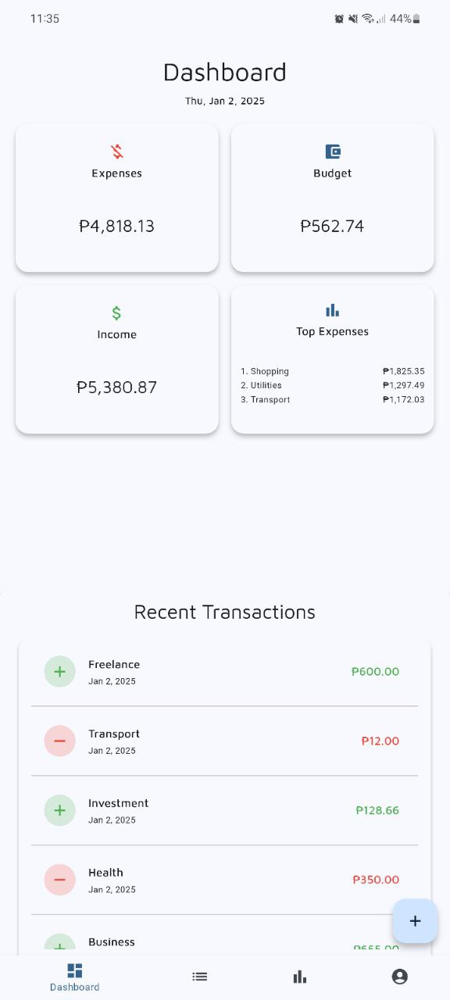
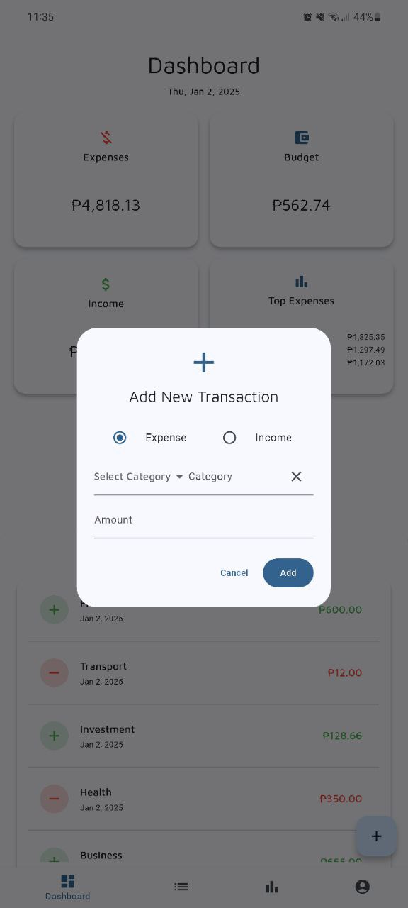
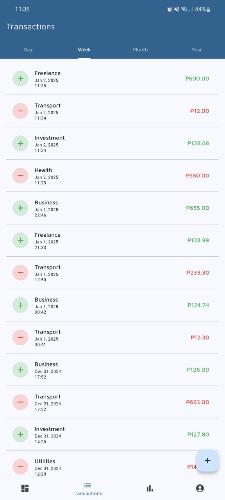
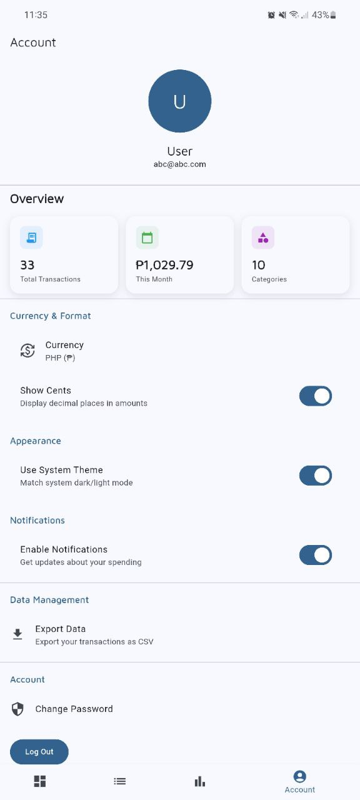
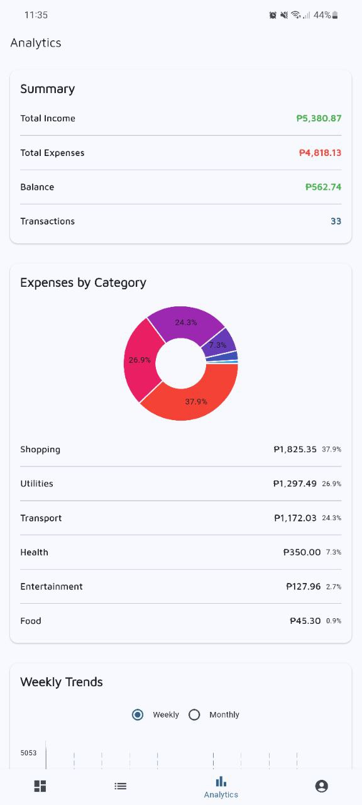
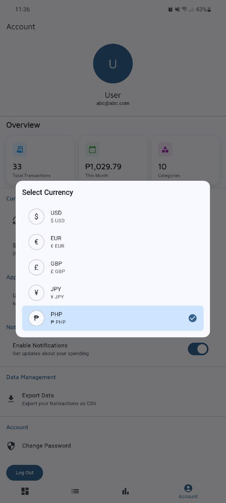

# Fundi - Smart Finance Tracker

<div align="center">
  <picture>
    <source media="(prefers-color-scheme: dark)" srcset="lib/assets/logo/logoDark.svg" width="300">
    <source media="(prefers-color-scheme: light)" srcset="lib/assets/logo/logoLight.svg" width="300">
    
  </picture>

  <p align="center">
    <strong>Empower Your Financial Journey</strong>
  </p>

  <p align="center">
    <a href="#-features">Features</a> •
    <a href="#-getting-started">Getting Started</a> •
    <a href="#-screenshots">Screenshots</a> •
    <a href="#-contributing">Contributing</a>
  </p>

  <p align="center">
    
    
    
  </p>
</div>

---

## Overview

Fundi is a **cutting-edge personal finance management application** designed to transform how you understand and control your financial life. By combining intuitive design with powerful analytics, Fundi empowers you to make smarter financial decisions effortlessly.

---

## Key Features

### Comprehensive Financial Management
- **Intelligent Expense Tracking**
  - Real-time transaction categorization
  - Detailed spending insights
  - Customizable budget allocations

### Advanced Financial Analytics
- **Predictive Insights**
  - Personalized spending trend analysis
  - Future financial projections
  - Interactive data visualizations

### Smart Budgeting
- **Dynamic Budget Tools**
  - Automated expense tracking
  - Goal-setting mechanisms
  - Personalized financial recommendations

### Seamless User Experience
- **Cross-Platform Compatibility**
  - Responsive design
  - Dark and light themes
  - Intuitive user interface

---

## Technical Architecture

### Technologies
- **Frontend**: Flutter
- **State Management**: Provider
- **Backend**: Firebase
- **Design System**: Material Design 3
- **Charting**: fl_chart

### Security Highlights
- End-to-end data encryption
- Secure authentication
- Privacy-first design principles

---

## Screenshots

<div style="display: flex; overflow-x: auto; white-space: nowrap; gap: 10px; padding: 10px 0;">
  
  
  
  
  
  
  
</div>

*Swipe or scroll horizontally to view all screenshots*

---

## Getting Started

### Prerequisites
- Flutter 3.10+
- Dart 3.0+
- Android Studio or VS Code

### Installation Steps
1. **Clone the Repository**
   ```bash
   git clone https://github.com/cbrf2002/Fundi.git
   ```

2. **Install Dependencies**
   ```bash
   flutter pub get
   ```

3. **Run the Application**
   ```bash
   flutter run
   ```

---

## Contributing

We welcome contributions! Here's how you can help:

- **Report Bugs**: Open GitHub issues
- **Suggest Features**: Create feature request issues
- **Submit PRs**: Help improve the codebase

Please read our [Contributing Guidelines](CONTRIBUTING.md) before getting started.

---

## License

This project is licensed under the MIT License. See the [LICENSE](LICENSE) file for details.

---

## Acknowledgments

- Flutter Community
- Firebase Team
- Open Source Contributors

**Made with ❤️ by [Your Name/Organization]**
